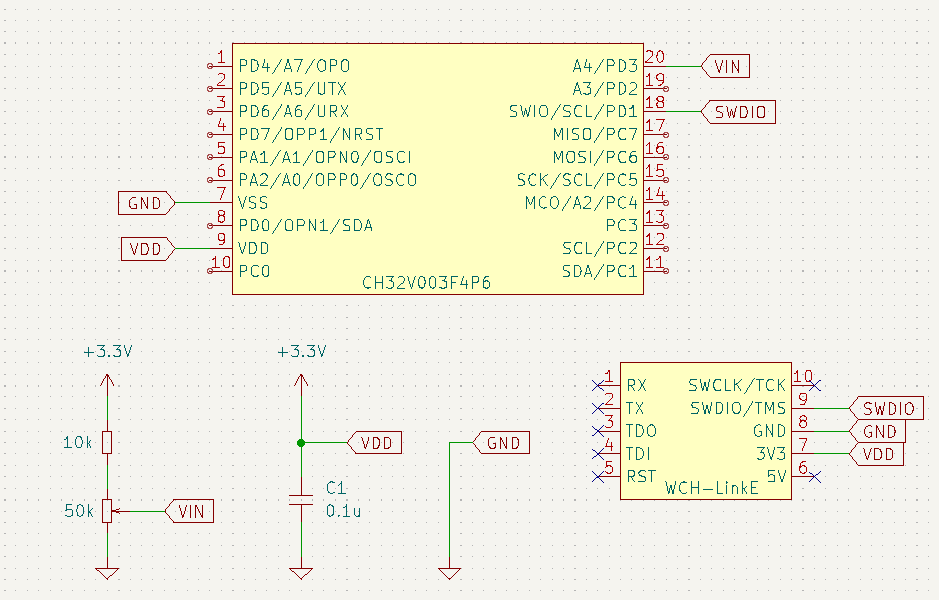

# CH32V003 ADC DMA

## How to build and execute

```bash
> make clean && make && ../ch32v003fun/minichlink/minichlink -T
:
 450 [ 450]
 402 [ 402]
 443 [ 443]
 392 [ 392]
 397 [ 397]
 :
```

## Circuit

