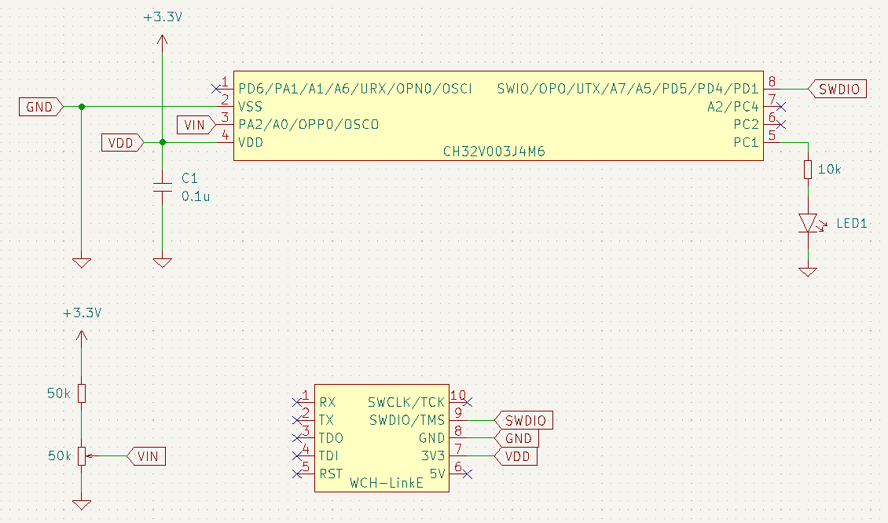

# ch32v003-adc

ADCの最も基本的な使い方

mainループ内で、毎回ADCの変換結果のレジスタの値を参照しており、
取り出した結果はprintfでシリアル出力している。

下図のような可変抵抗の分圧回路を作成して、PA2で0V～1.65Vあたりの電圧変化を読み取る。



minichlinkツールで、コンソール表示することが可能。

```bash
> ../ch32v003fun/minichlink/minichlink -T
Found WCH Link
WCH Programmer is LinkE version 2.10
Chip Type: 003
Setup success
Flash Storage: 16 kB
Part UUID    : ab-d0-ab-cd-13-f8-bc-5b
PFlags       : ff-ff-ff-ff
Part Type (B): 07-13-bb-91
Read protection: disabled
Interface Setup
@
Count: 54644 adc: 137
Count: 54645 adc: 144
Count: 54646 adc: 137
Count: 54647 adc: 137
：
```
