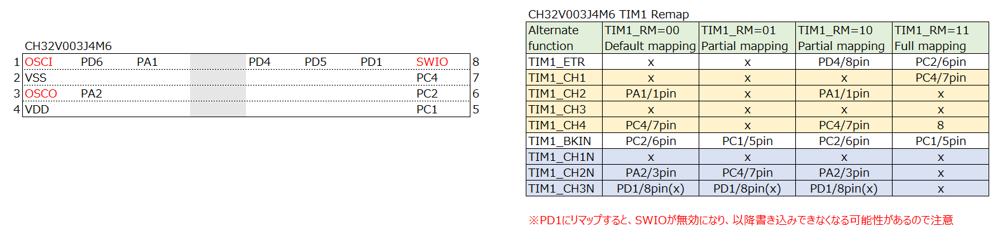

# CH32V003 Timer1 PWM

## How to build and execute

```bash
> make clean && make && ../ch32v003fun/minichlink/minichlink -T
:

```

## Setup

PWM波形出力するピンとチャンネルは以下のとおり。

|GPIO|PWMピン|
|--|--|
|PA1|PWM_CH2|
|PA2|PWM_CH2N|
|PC4|PWM_CH4|


Timer1のリマップ設定は下図になる。今回はデフォルト（TIM1_RM=00）のままなので、リマップする必要なし。



PA1とPA2はCH2でコンプリメンタリ（相互補完）な波形を出力できるようになっており、サンプルプログラムでもそうしている。オシロスコープなどで波形を確認できる。

各チャンネル用のコンペア値を設定できる16bitレジスタ（TIM1->CHxCVR）が用意されているので、ここで設定した値までカウントされると出力がHIGHまたはLOWになる。このあたりの設定は、CHCTLRxで定義する。


CH4の波形はDuty比50%にする場合、ATRLRの50%の値をCH4CVRに設定する。CH2は25%になっている。また、CH2Nも有効にしており、CH2の相互補完ということでCH2の反転した波形になる。

CH32V003のキャプチャ・コンペアは下図のように最大4チャンネルで、CH1~3が相互補完可能。


### オシロスコープで確認


CH4が黄色、CH2、CH2Nが青とピンクの波形。


### そのほか

Timer1の場合は、デッドバンド設定が可能。波形を入力してHIGHをカウントさせるエンコーダー機能などもある。

